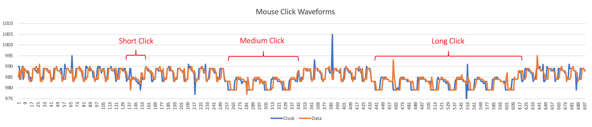
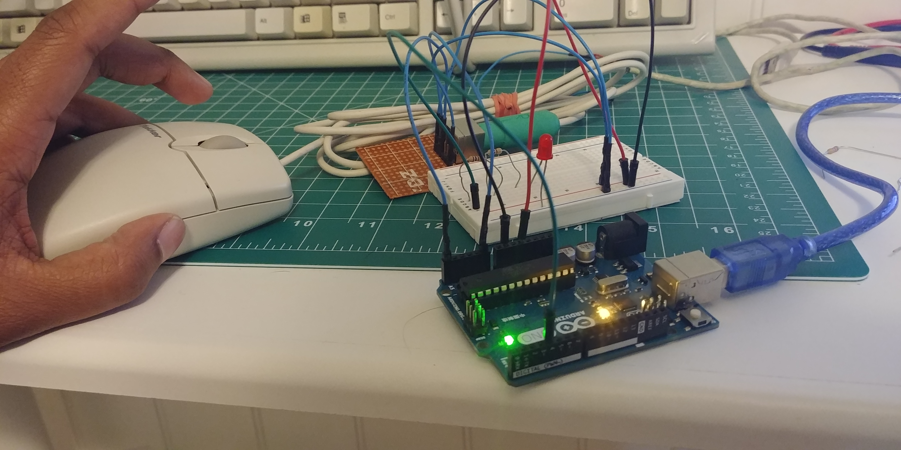
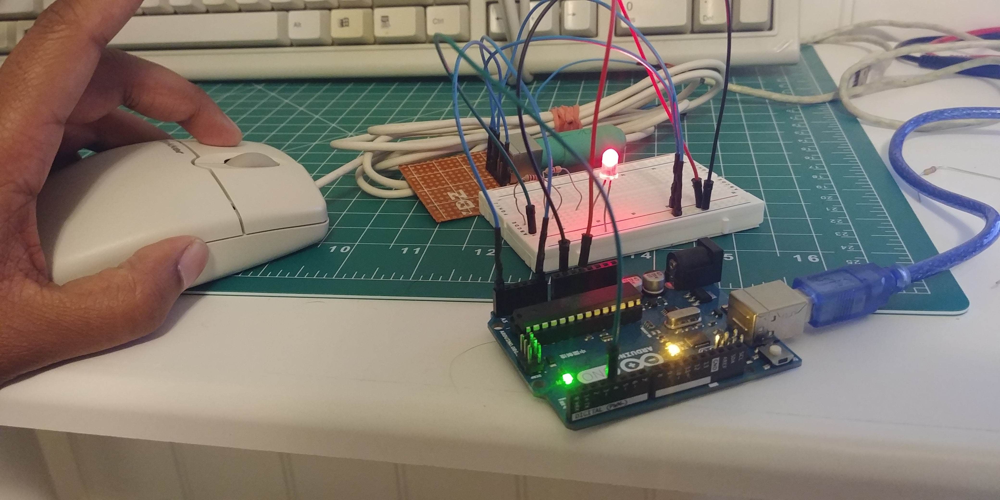
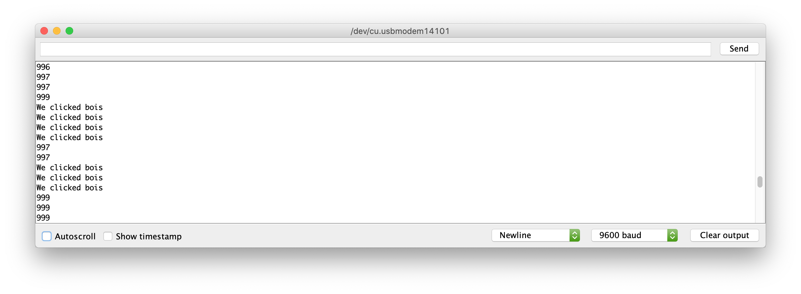
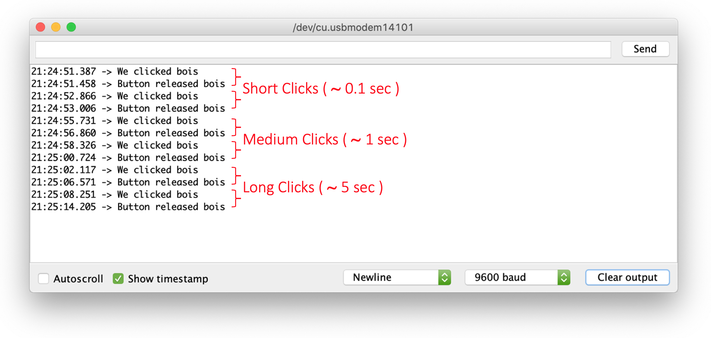

# Project Summary 
This project is my exploration of the PS/2 interface. Through this project I am learning about how the PS/2 protocol worked by reverse engineering it.

## Project Goal
My goal for this project is to receive data being sent from the PS/2 mouse and use an arduino as a way to decode and translate it into commands that control my cursor on my computer, essentially creating a PS/2 to USB interface. I also hope to build an intuition as to how communication protocols worked from a practical standpoint and develop personal methodologies for further reverse engineering.

## Observations Log
### 24 March 2021
The Clock and Data pins are connected to the Arduino and are being read by AnalogRead, which reads the raw analog voltage. This data is outputted to the Serial Console and graphed in Excel.
<!------>

    
    
Figure 1. Mouse Clicks identified on plotted Analog Clock and Data Waveforms

The graph above shows that the Clock and Data values oscillate with the same values and possibly have high frequency noise present. Also, the waveforms translate downwards during the duration a mouse button is pressed down and only translate back to its original position after the mouse button is released.

The waveforms do not translate however when the scroll wheel is scrolled or when the mouse is moved.

### 31 March 2021 
Using the analog values from the Data pins, I have been able to implement a rudimentary click detection. When the mouse is clicked, I am outputting to the Arduino Serial Console as well as lighting an LED. This was done by using the waveform information shown in the graph above. Through this approach, I am able to detect when a button on the mouse is clicked and for the full duration the button is pressed down.

Through trial and error, I found that the analog values from the Data pin only drop below the *magic number 977* when a button on the mouse is ***clicked*** and only exceed the *magic number 995* when a button on the mouse is ***not clicked***. 

    <figure>
        
        
        
Figure 2. LED lights up when a Mouse Button is clicked or pressed down and stays lit the entire duration of the press.

    </figure>

  
  
Figure 3. When a button is pressed, the Serial Console prints the Click message. When a button is not pressed, the Serial Console prints the analog voltage.

#### Limitations With This Approach
1. This approach sends multiple messages when a button on the mouse is held down. Depending upon how the message is interpretated on the other end, one held down button may trigger multiple short clicks rather than one long click. This is not ideal. 

2. This approach can not differentiate between which button on the mouse is pressed. The mouse I am using has three buttons: left, right, and scroll wheel (which can also click down). Therefore, this approach prevents triggering button specific events such as left click to select versus right click for more options. 

3. Also, this approach is only looking at the transformations to the waveform as a whole, and is thus susceptible to noise triggering false clicks or prematurely ending a click.

4. Finally, by only analyzing the waveform, I am not decoding the actual bytes of data being sent by the mouse. Therefore, not only am I not able to detect which button was pressed, but I also am not able to detect when the mouse has been moved or when the scroll wheel has been scrolled. 

### 1 April 2021 - This is no joke.
I have updated the rudimentary click detection code to remember state: the click status. If the mouse button is held down, rather than repeatedly sending a message that the button has been clicked, it only sends a message when the button was first pressed down and when the button is finally released. This can be seen in the screenshot below of the serial console. The output messages have been timestamped. 
<!---

Figure 4. Serial Console outputting Button Clicked and Button Released Messages

--->

    
    
Figure 4. Serial Console outputting Button Clicked and Button Released Messages

This iteration on the rudimentary click detection overcomes Limitation #1 listed under 31 March's Log entry. 
